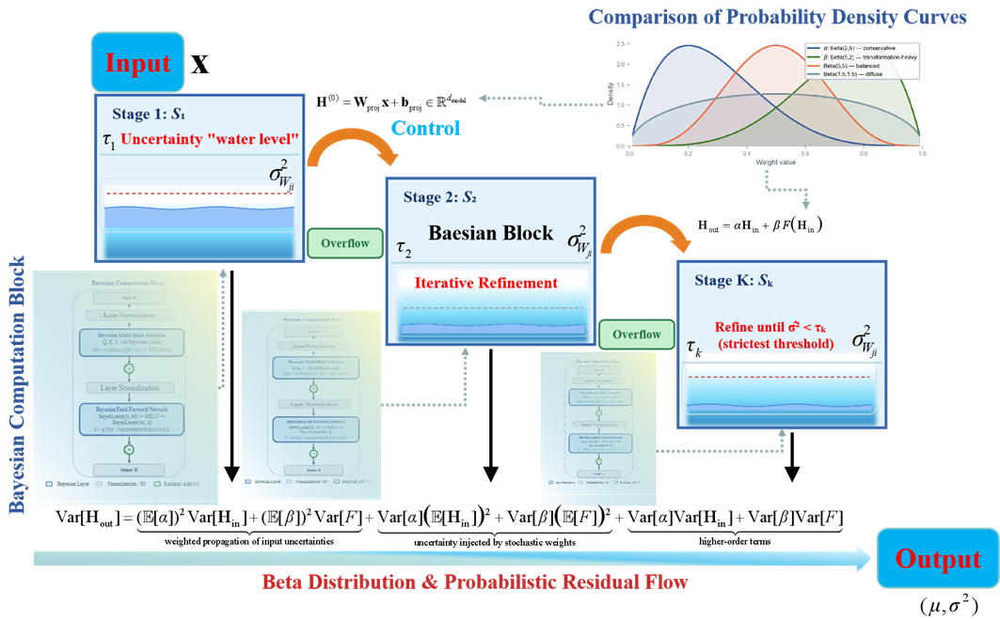

# BRC: Bayesian Residual Cascade

A PyTorch implementation of **Bayesian Residual Cascade** for deep regression with built-in uncertainty quantification.

BRC treats residual connections as stochastic regulators of uncertainty propagation rather than fixed identity mappings. It unifies three mechanisms into a single end-to-end trainable architecture:

- **Beta-distributed residual weights** that modulate how variance flows between stages
- **Uncertainty-driven iterative refinement** that repeats each Bayesian block until variance meets a learned threshold
- **Cascade aggregation** that adapts computation depth per sample, simple inputs exit early, complex inputs use full depth

## Architecture



Each cascade stage contains a **Bayesian Computation Block** (variational multi-head attention + Bayesian FFN) wrapped with Beta-distributed probabilistic residual connections. Stages iteratively refine representations until variance drops below a learned threshold, with deeper stages enforcing stricter thresholds.

## Quick Start

### Install

```bash
pip install torch numpy scikit-learn scipy pandas matplotlib
```

### Train

```bash
# Energy Efficiency dataset, default hyperparameters
python train.py --dataset energy --epochs 200

# California Housing, 5 independent trials
python train.py --dataset california --epochs 200 --n_trials 5

# Custom architecture
python train.py --dataset power --d_model 256 --n_heads 8 --K 6 --T_max 4 --d_ff 1024
```

Available datasets: `energy`, `california`, `power`, `student`

### Use in your code

```python
import torch
from brc import BRC

model = BRC(
    input_dim=8,
    d_model=128,
    n_heads=4,
    K=4,          # cascade stages
    d_ff=512,
    T_max=3,      # max refinement iterations per stage
    tau_base=0.1, # base variance threshold
    r=0.5,        # threshold decay across stages
)

x = torch.randn(32, 8)
y = torch.randn(32)

# training
model.train()
loss, info = model.compute_loss(x, y, lambda_kl=1e-3, lambda_cas=1.0)
loss.backward()

# inference
pred = model.predict(x, confidence=0.95)
print(pred["mu"])     # point prediction
print(pred["sigma"])  # total uncertainty
print(pred["lower"])  # 95% lower bound
print(pred["upper"])  # 95% upper bound
```

### Evaluate

```python
from brc.metrics import compute_r2, compute_picp, compute_pinaw, compute_ece_quantile, compute_crps

# assuming you have y_true, mu, sigma, lower, upper from model.predict()
print("R2:   ", compute_r2(y_true, mu))
print("PICP: ", compute_picp(y_true, lower, upper))
print("PINAW:", compute_pinaw(lower, upper, y_true=y_true))
print("ECE:  ", compute_ece_quantile(y_true, mu, sigma))
print("CRPS: ", compute_crps(y_true, mu, sigma))
```

## Key Hyperparameters

| Parameter | Default | Description |
|-----------|---------|-------------|
| `K` | 4 | Number of cascade stages |
| `T_max` | 3 | Max refinement iterations per stage |
| `tau_base` | 0.1 | Base variance threshold (stage 1) |
| `r` | 0.5 | Threshold decay rate; stage k uses `tau_base * r^k` |
| `lambda_kl` | 1e-3 | KL regularization weight |
| `lambda_cas` | 1.0 | Cascade variance penalty weight |

## Project Structure

```
BRC_Code/
  brc/
    __init__.py
    model.py      # BRC model (forward, loss, predict)
    layers.py     # BayesianLinear, Attention, FFN, Block, ProbResidual, CascadeStage
    losses.py     # standalone loss module
    metrics.py    # R2, PICP, PINAW, ECE, CRPS, AUSE
  train.py        # training script with argparse
  requirements.txt
```
## Datasets

All datasets are publicly available. The training script downloads them automatically via scikit-learn.

| Dataset | Samples | Features | Target | Source |
|---------|---------|----------|--------|--------|
| Energy Efficiency | 768 | 8 | Heating load | [UCI ML Repository](https://archive.ics.uci.edu/dataset/242/energy+efficiency) |
| California Housing | 20,640 | 8 | Median house value | [StatLib / sklearn](https://scikit-learn.org/stable/datasets/real_world.html#california-housing-dataset) |
| Power Plant | 9,568 | 4 | Net hourly electrical energy output | [UCI ML Repository](https://archive.ics.uci.edu/dataset/294/combined+cycle+power+plant) |
| Student Performance | 395 | 15 | Final grade (G3) | [UCI ML Repository](https://archive.ics.uci.edu/dataset/320/student+performance) |
| Household Power | 17,520 | 7 | Global active power | [UCI ML Repository](https://archive.ics.uci.edu/dataset/235/individual+household+electric+power+consumption) |

## Results

Benchmark results on structured regression tasks (200 epochs, 5 trials):

| Dataset | R2 | ECE | PICP | PINAW |
|---------|------|-------|--------|--------|
| Energy Efficiency | 0.845 | 0.047 | 0.980 | 0.312 |
| California Housing | 0.802 | 0.081 | 0.976 | 0.428 |
| Power Plant | 0.935 | 0.052 | 0.995 | 0.453 |

BRC achieves the lowest ECE among compared methods (MC Dropout, Deep Ensemble, BDL, GP) while maintaining competitive R2 and near-nominal PICP.

## License

MIT

## Contact

Wencan Guan - wencan.guan@uni-weimar.de
